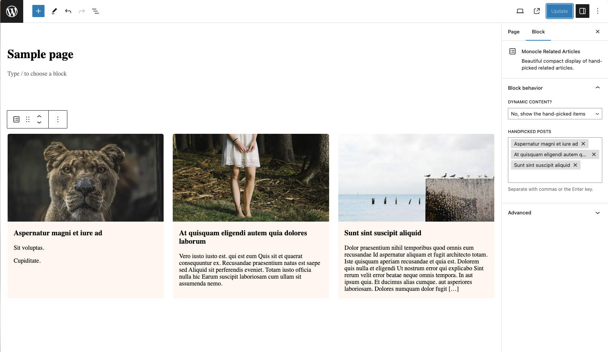
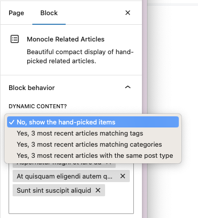

# Monocle Related Articles custom block

This custom block allows you to display a list of 3 related articles based on the current article's categories, tags, most recent of the same post type or hand-picked.

This is part of the PoC to show how to create custom blocks for Monocle.

## Installation

This is a WordPress plugin. To install it, download the zip file and upload it to your WordPress site. Then activate the plugin.

## Usage

To use this block, you need to add it to a post or page. You can then select the type of related articles you want to display, using the block configuration in the side panel.

